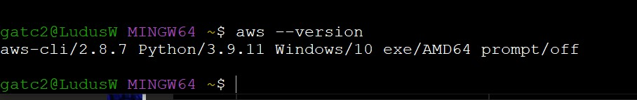

# Week 0 — Billing and Architecture

## 02/13/2023  
  - Today I expended some time reviewing the first 3 videos in the student portal. The video about the security of the account was handy. I never used before AWS Organization for my personal accounts. Of course, I used AWS Organizations, Control Tower, and SSO in the company account but not for my personal projects. 
  - I  sent an invite to my account from a centralized account, which was very interesting for me. I need to check the budget for my projects but I think I can enable some SCP for my accounts. 
  - I am checking the Lucid Chart video from Andrew. I think tomorrow morning I will create both diagrams.
 
## 02/14/2023
- Today a worked on the Cruddur Logical Diagram. I understand the application flow. 
- I never used Lucidchart before. Seems like a good tool for my future projects. I used to use Microsoft Visio, but Lucidchart is really great. Thank you for that.

- Lucid Chart Link - https://lucid.app/lucidchart/9f9f9abc-2bf5-4342-bd90-f629781795f5/edit?viewport_loc=-103%2C-599%2C1707%2C779%2C0_0&invitationId=inv_89c15a40-a05d-4efa-875d-0e02e6d14e23

- In order to have all processes documented, this is the conceptual diagram for the Cruddur Application.
- This process is helping me to understand all the architecture for the application

- Lucid Chart Link - https://lucid.app/lucidchart/9fbc9012-3157-4fc1-8986-12f7da1dabfd/edit?viewport_loc=-10%2C13%2C1707%2C779%2C0_0&invitationId=inv_aacb967a-9fad-4ae3-9874-6adb9a10e6e2

## 02/15/2023

- In order to be in compliance with the security requirements, I am using AWS Organization in my accounts to have different accounts for each project

- I create and Admin user for the master account and for the bootcamp account. In both of them there are an admin user.

- In this case, I am using a Windows Laptop for the bootcamp, but I feel more comfortable with Linux terminal. So, in this case, I installed the Git terminal in order to have some commands from the Linux side. The AWS CLI is installed and ready to make magic.

- I create a Budget with $ 25.00 USD as maximun for now. I don't know if that threshold is enough but I will try to mantein that maximun. In addition, I create an alert in roder to have an email when this threshold is near to the 80%

